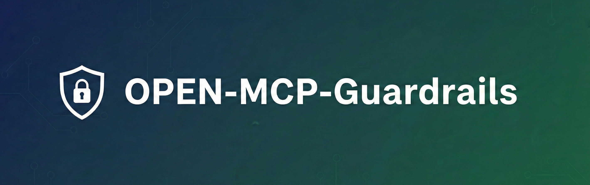

<p align="center">
  
</p>

     

[English](./README.md)

任意の MCP サーバーの前段にポリシーベースのガードレールを挟むプロキシ。

既存の MCP サーバーコマンドの前に `open-mcp-guardrails` を付けるだけで、PII 漏洩・シークレット流出・プロンプトインジェクションからアプリを守れます。

## 要件

- [Node.js](https://nodejs.org/) >= 23.6.0

`guardrails.config.ts` を Node.js のネイティブ [Type Stripping](https://nodejs.org/en/learn/typescript/run-natively) で直接読み込むため、Node.js 23.6 以上が必要です。コンパイルは不要です。

## インストール

```bash
npm install open-mcp-guardrails
```

## クイックスタート

### 1. 設定ファイルを作成

```bash
npx open-mcp-guardrails init
```

対話式プロンプトで TypeScript と JSON を選択できます:

```
  Select config format:
    1) TypeScript  (guardrails.config.ts)
    2) JSON        (guardrails.json)

  Choice [1]:
```

`--json` でプロンプトをスキップして JSON を直接生成できます。

#### TypeScript

```ts
// guardrails.config.ts
import { defineConfig, pii, secrets } from "open-mcp-guardrails";

export default defineConfig({
  rules: [
    pii().block(),
    secrets().block(),
  ],
});
```

引数なしの `defineConfig()` で PII + シークレット保護がデフォルトで有効になります。

#### JSON

```json
{
  "$schema": "https://unpkg.com/@interactive-inc/open-mcp-guardrails@latest/dist/guardrails.schema.json",
  "rules": [
    { "type": "pii", "action": "block" },
    { "type": "secrets", "action": "block" }
  ]
}
```

JSON で約 90% のユースケースをカバーできます。`custom()` ルールや複雑な `tool().check()` が必要な場合は TypeScript を使用してください。

### 2. MCP クライアントに登録

**Claude Code** — プロジェクトルートに `.mcp.json` を作成:

```json
{
  "mcpServers": {
    "filesystem": {
      "command": "npx",
      "args": [
        "open-mcp-guardrails",
        "--",
        "npx", "@modelcontextprotocol/server-filesystem", "/tmp"
      ]
    }
  }
}
```

カレントディレクトリの `guardrails.config.ts` が自動検出されるため、`-c` フラグは不要です。

**Claude Desktop** — `~/.config/open-mcp-guardrails/guardrails.config.ts` に設定を配置し、`claude_desktop_config.json` に追加:

```json
{
  "mcpServers": {
    "filesystem": {
      "command": "npx",
      "args": [
        "open-mcp-guardrails",
        "--",
        "npx", "@modelcontextprotocol/server-filesystem", "/tmp"
      ]
    }
  }
}
```

`--` の前がガードレールの設定、後ろが元々の MCP サーバーコマンドです。

### 設定ファイルの検索順序

`-c` が指定されていない場合、以下の順序で自動検出されます:

1. `./guardrails.config.ts`（カレントディレクトリ）
2. `./guardrails.json`（カレントディレクトリ）
3. `~/.config/open-mcp-guardrails/guardrails.config.ts`（XDG ユーザー設定）
4. `~/.config/open-mcp-guardrails/guardrails.json`（XDG ユーザー設定）

`-c <path>` で明示的に指定することもできます。

## ルール

### プリセット

最もシンプルな方法 — `protect` でプリセットを選択:

```ts
export default defineConfig({
  protect: ["pii", "secrets", "prompt-injection"],
});
```

| プリセット | 説明 |
|---|---|
| `"pii"` | メール、電話番号、クレジットカード番号、SSN 等をブロック |
| `"secrets"` | API キー、トークン、秘密鍵等をブロック |
| `"prompt-injection"` | プロンプトインジェクション攻撃をブロック |

JSON の場合:

```json
{
  "protect": ["pii", "secrets", "prompt-injection"]
}
```

### Fluent Builder API

完全な制御にはビルダー API を使用:

```ts
import {
  defineConfig, pii, secrets, promptInjection,
  contentFilter, flow, tool, custom,
} from "open-mcp-guardrails";

export default defineConfig({
  rules: [
    // 検出ルール — scope で特定ツールに限定
    pii().scope("filesystem__read_file").block(),
    secrets().exclude("generic_secret").warn(),
    promptInjection().threshold(0.5).block(),
    contentFilter(["機密", /confidential/i]).block(),

    // フロー制御
    flow("get_website").to("send_email").block(),

    // ツール引数バリデーション
    tool("send_email")
      .check(args => !(args.to as string)?.endsWith("@company.com"))
      .block("社内アドレスのみ"),

    // カスタムロジック
    custom("rate-limit")
      .phase("pre")
      .evaluate(ctx => {
        if (ctx.trace.toolCalls.length > 100) {
          return [{
            ruleName: "rate-limit",
            message: "ツールコール上限超過",
            severity: "error",
          }];
        }
        return [];
      })
      .block(),
  ],
});
```

全てのビルダーは `.block()` / `.warn()` / `.log()` のターミナルメソッドで終了します。

### scope — 検出を特定ツールに限定

検出ルール（`pii`, `secrets`, `promptInjection`, `contentFilter`）はデフォルトで全ツールに適用されます。`.scope()` で特定のツールに制限できます:

```ts
pii().scope("filesystem__read_file").block();
secrets().scope(/^filesystem__/).block();
```

ツール名は `{server}__{tool}` 形式です（例: `filesystem__read_file`, `github__create_issue`）。

JSON の場合:

```json
{ "type": "pii", "action": "block", "scope": ["filesystem__read_file"] }
{ "type": "secrets", "action": "block", "scope": ["/^filesystem__/"] }
```

## CLI

```bash
# プロキシ起動（設定は自動検出）
open-mcp-guardrails -- npx @modelcontextprotocol/server-filesystem /tmp

# 明示的にパス指定
open-mcp-guardrails -c custom.config.ts -- npx @modelcontextprotocol/server-github

# 設定ファイルのスキャフォールド（対話式プロンプト）
open-mcp-guardrails init

# JSON を直接生成
open-mcp-guardrails init --json

# 設定ファイルのバリデーション
open-mcp-guardrails check

# JSON Schema を出力
open-mcp-guardrails schema
```

## 対応クライアント

- [Claude Code](https://interactive-inc.github.io/open-mcp-guardrails/ja/guide/claude-code) — `.mcp.json` プロジェクトレベル設定
- [Claude Desktop](https://interactive-inc.github.io/open-mcp-guardrails/ja/guide/claude-desktop) — `claude_desktop_config.json`
- [Codex CLI](https://interactive-inc.github.io/open-mcp-guardrails/ja/guide/codex) — `.codex/config.toml`

## ドキュメント

詳細なガイドと API リファレンスは [ドキュメントサイト](https://interactive-inc.github.io/open-mcp-guardrails/ja/) を参照してください。

- [概要](https://interactive-inc.github.io/open-mcp-guardrails/ja/guide/introduction) — アーキテクチャと特徴
- [クイックスタート](https://interactive-inc.github.io/open-mcp-guardrails/ja/guide/quick-start) — 設定ファイルの作成と動作確認
- [設定](https://interactive-inc.github.io/open-mcp-guardrails/ja/guide/configuration) — 設定オプション、プリセット、scope
- [API リファレンス](https://interactive-inc.github.io/open-mcp-guardrails/ja/api/) — Fluent Builder API の詳細

## ライセンス

MIT
