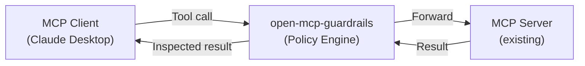

# Introduction

## What is open-mcp-guardrails?

A policy-based guardrails proxy that sits in front of any MCP server.

It scans both **arguments** and **outputs** of tool calls, detecting and blocking content that violates your policies.

## Features

### PII & Secret Protection

Automatically detects and blocks sensitive information like email addresses, phone numbers, credit card numbers, API keys, and tokens from leaking between tools.

### Flow Control

Controls dangerous tool call patterns like `web fetch → email send`, preventing unintended data exfiltration.

### Prompt Injection Detection

Detects and blocks prompt injection attacks using scoring-based heuristics.

### Zero-Config Start

Just call `defineConfig()` with no arguments to enable PII + secret protection by default. Customize rules as needed.

## Next Steps

- [Installation](/guide/installation) — Install via npm
- [Quick Start](/guide/quick-start) — Create your first config file
