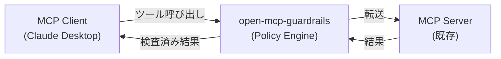

# 概要

## open-mcp-guardrails とは

任意の MCP サーバーの前段にポリシーベースのガードレールを挟むプロキシです。

ツール呼び出しの **引数** と **出力** の両方をスキャンし、ポリシーに違反する内容を検出・ブロックします。

## 特徴

### PII・シークレット保護

メールアドレス、電話番号、クレジットカード番号、API キー、トークンなどの機密情報がツール間で漏洩するのを自動検出・ブロックします。

### フロー制御

`Web 取得 → メール送信` のような危険なツール呼び出しパターンを制御し、データの意図しない外部送信を防止します。

### プロンプトインジェクション検出

スコアリングベースのヒューリスティクスで、プロンプトインジェクション攻撃を検出・ブロックします。

### ゼロコンフィグで開始

`defineConfig()` を引数なしで呼ぶだけで PII + シークレット保護が有効に。必要に応じてルールをカスタマイズできます。

## 次のステップ

- [インストール](/ja/guide/installation) — npm でインストール
- [クイックスタート](/ja/guide/quick-start) — 最初の設定ファイルを作成
